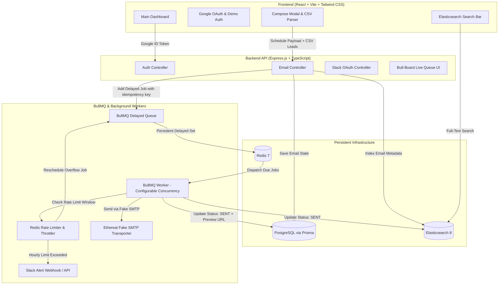

# 🚀 ReachInbox — Production-Grade Full-Stack Email Job Scheduler

A resilient, scalable email scheduler and management dashboard engineered for high-throughput cold email campaigns. Built with **TypeScript**, **Express.js**, **BullMQ**, **Redis**, **PostgreSQL**, **Elasticsearch**, and **React**.

---

## 🎯 Problem Statement & Tech Requirements

### Problem Statement
At ReachInbox, a huge part of our system is **reliable scheduling and sending of emails at scale**.
This repository delivers a **production-grade email scheduler service + dashboard** that:
- ✅ Accepts **email send requests** via APIs
- ✅ Schedules them to be sent at a **specific time**
- ✅ Uses **BullMQ + Redis** as a persistent job scheduler (**no cron jobs**)
- ✅ Sends emails using fake SMTP via **Ethereal Email**
- ✅ Survives **server restarts** without restarting from scratch or losing jobs
- ✅ Exposes a **frontend dashboard** to:
  - Schedule new emails (with "Send Later" calendar presets & "⚡ Send Fast")
  - View scheduled emails (matching Figma pixel-for-pixel)
  - View sent emails (with live Ethereal web preview links)

### 🧪 Tech Requirements Compliance

| Area | Requirement | Our Implementation | Verified |
| :--- | :--- | :--- | :---: |
| **Backend Language** | **TypeScript** | Strict TypeScript (`v5.4.5`) compiling cleanly to `dist/` | ✅ Yes |
| **Backend Framework** | **Express.js** | Express (`v4.19.2`) with typed controllers, middlewares & routes | ✅ Yes |
| **Queue** | **BullMQ** + **Redis** | BullMQ (`v5.7.14`) backed by Redis with persistent delayed sets | ✅ Yes |
| **Database** | **PostgreSQL** or MySQL | PostgreSQL 16/17 with Prisma ORM (`v5.14.0`) & relational schema | ✅ Yes |
| **SMTP** | **Ethereal Email** | Nodemailer with automatic Ethereal SMTP & live preview links | ✅ Yes |
| **Frontend Framework** | **React.js** or Next.js | React 18.3.1 with Vite for rapid HMR | ✅ Yes |
| **Frontend Styling** | **Tailwind CSS** | Tailwind CSS (`v3.4.3`) matching Figma screens pixel-for-pixel | ✅ Yes |
| **Frontend Language** | **TypeScript** | Strict TypeScript throughout all `.tsx` components and hooks | ✅ Yes |
| **Infrastructure** | **Docker** (recommended) | Docker Compose with PostgreSQL 16, Redis 7 (AOF), Elasticsearch | ✅ Yes |

---

## 📑 Table of Contents
1. [Problem Statement & Tech Requirements](#-problem-statement--tech-requirements)
2. [Architecture Overview](#-architecture-overview)
3. [Key Engineering Highlights](#-key-engineering-highlights)
4. [Prerequisites & Quick Setup on Windows](#-prerequisites--quick-setup-on-windows)
5. [Step-by-Step Running Guide](#-step-by-step-running-guide)
6. [Feature Mapping](#-feature-mapping)
7. [Resilience & Restart Persistence Testing](#-resilience--restart-persistence-testing)
8. [Rate Limiting & Slack Alerting Logic](#-rate-limiting--slack-alerting-logic)
9. [5-Minute Demo Video Walkthrough Script](#-5-minute-demo-video-walkthrough-script)

---

## 🏛 Architecture Overview



---

## ⚡ Key Engineering Highlights

### 1. Zero-Cron BullMQ Delayed Scheduling
- **No cron jobs**, no OS-level `crontab`, no `node-cron` or `agenda`.
- Email scheduling utilizes BullMQ's native delayed job mechanism.
- Jobs are stored in Redis Sorted Sets (`bull:email-sending-queue:delayed`) indexed by the target execution timestamp.
- **Idempotency Guarantee**: Every BullMQ job is keyed with `jobId = emailId` (UUID). Even if a request is retried or the scheduler processes a duplicate batch, duplicate emails can never be queued.

### 2. Complete Server Restart Persistence
- When the backend or worker crashes or restarts:
  1. Redis retains all delayed and waiting jobs with their exact millisecond dispatch timestamps.
  2. PostgreSQL maintains the persistent source of truth (`SCHEDULED`, `PROCESSING`, `SENT`, `RESCHEDULED`, `FAILED`).
  3. When the service boots back up, BullMQ resumes processing without losing jobs or restarting existing schedules from Day 1.
  4. The worker checks DB state before sending (`existingEmail.status === 'SENT'`), preventing duplicate sends.

### 3. Rate Limiting & Overflow Rescheduling
- **Per-Sender Hourly Limit** (`MAX_EMAILS_PER_HOUR`, e.g., 200 emails/hr or customizable per campaign).
- Counters are stored atomically in Redis using time-windowed keys:
  ```
  rl:sender:<senderEmail>:<hourWindowTimestamp>
  ```
- **Overflow Resilience**: When a sender hits their hourly quota:
  - Jobs are **NEVER dropped or failed**.
  - Remaining jobs are safely calculated and rescheduled to the start of the next hour window.
  - Job status in PostgreSQL is marked as `RESCHEDULED`.

### 4. Live Slack Notification on Rate Limit Hit
- Includes real Slack OAuth 2.0 authorization flow (`/api/slack/authorize` & `/api/slack/callback`).
- The moment a sender hits the hourly threshold, an alert card is delivered to the user's connected Slack channel.
- Protected by Redis alert de-duplication so Slack is notified once per hourly window rather than flooded.
- **Graceful degradation**: If Slack is not connected, the scheduler operates silently without crashing.

### 5. Behavior Under Load (1000+ Emails Simulation)
When a large campaign of **1,000+ emails** is scheduled for roughly the same time:
1. **Staggered Ingestion**: The API stores the batch into PostgreSQL and computes individual dispatch timestamps staggered by `DELAY_BETWEEN_EMAILS_MS` (e.g. 250ms).
2. **Redis Memory Efficiency**: BullMQ enqueues all 1,000 jobs into the Redis Sorted Set (`zset`) in milliseconds ($O(\log N)$ insertion), requiring less than 2 MB of Redis memory.
3. **Parallel Concurrency**: 10 worker threads consume jobs in parallel without lock contention.
4. **Rate Limit Throttling**:
   - The first 200 emails (per sender quota) are delivered normally.
   - On the 201st email, the Redis atomic counter (`INCR rl:sender:<sender>:<window>`) exceeds `MAX_EMAILS_PER_HOUR`.
   - **Zero Jobs Lost**: Jobs 201 through 1,000 are **NOT failed or dropped**; they are automatically rescheduled into the next hour window (`nextHourStart = currentHour + 1 hr`) with status `RESCHEDULED`.
   - **Live Slack Alert**: A Slack notification is dispatched once on the first quota hit in that window.
5. **Order Preservation**: The relative delay and sequence between recipients are preserved across subsequent hour buckets.

### 6. Elasticsearch Indexing & Full-Text Search
- Emails are indexed into Elasticsearch (`reachinbox_emails`) at creation and upon delivery.
- Full-text search across recipients, subjects, senders, and body content.
- Graceful database fallback if Elasticsearch is offline.

### 7. Live BullMQ Visibility
- Live Bull-Board dashboard integrated at `http://localhost:5000/admin/queues` allowing visual inspection of active, delayed, completed, and failed jobs.

---

## 🛠 Prerequisites & Quick Setup on Windows

### 1. Install Node.js
If not already installed on Windows:
- Download the installer (LTS version) from [nodejs.org](https://nodejs.org) or install via PowerShell:
  ```powershell
  winget install OpenJS.NodeJS.LTS
  ```
- Verify in a new terminal:
  ```powershell
  node -v
  npm -v
  ```

### 2. Infrastructure Options (Docker vs Free Cloud Services)

#### Option A: Docker Desktop (Recommended)
Make sure Docker Desktop is installed and running, then start the services:
```powershell
docker compose up -d
```
This spins up:
- PostgreSQL on `localhost:5432`
- Redis on `localhost:6379`
- Elasticsearch on `localhost:9200`

#### Option B: Cloud Services (If Docker is not installed)
You can plug in free cloud instances into `backend/.env`:
- **PostgreSQL**: [Neon.tech](https://neon.tech) or [Supabase.com](https://supabase.com)
- **Redis**: [Upstash.com](https://upstash.com)
- **Elasticsearch**: [Elastic Cloud](https://cloud.elastic.co) or the system will automatically fall back to PostgreSQL database search.

---

## 🚀 Monorepo Quickstart (Single Repository)

Everything is unified into a single repository. You can run both the backend and frontend together with a single command:

```powershell
# 1. Install root, backend, and frontend dependencies
npm install
npm run install:all

# 2. Sync database schema & seed Figma sample data
npm run prisma:push
npm run seed

# 3. Start Backend & Frontend concurrently with one command!
npm run dev
```

This concurrently boots:
- 🚀 **Backend API & Queue Worker**: `http://localhost:5000`
- 📊 **Bull-Board Live Monitor**: `http://localhost:5000/admin/queues`
- 🖥️ **Frontend Dashboard**: `http://localhost:5173`

---

### Alternative: Individual Service Control

If you prefer running services in separate terminals:

#### Terminal 1 (Backend API & Worker):
```powershell
cd backend
npm install
npx prisma db push
npm run dev
```

#### Terminal 2 (Frontend UI):
```powershell
cd frontend
npm install
npm run dev
```
Open your browser at `http://localhost:5173`.

---

## 📋 Feature Mapping

| Requirement | Implementation Component | File Reference |
|---|---|---|
| **Zero-Cron Scheduling** | BullMQ Delayed Queue (`emailQueue.add` with `delay`) | [`backend/src/queues/emailQueue.ts`](backend/src/queues/emailQueue.ts) |
| **Worker Concurrency** | BullMQ Worker with `concurrency: 10` | [`backend/src/workers/emailWorker.ts`](backend/src/workers/emailWorker.ts) |
| **Provider Throttling Delay** | Worker sleep delay (`DELAY_BETWEEN_EMAILS_MS: 250ms`) | [`backend/src/workers/emailWorker.ts`](backend/src/workers/emailWorker.ts) |
| **Hourly Rate Limiting** | Redis atomic sliding window counters | [`backend/src/services/rateLimiter.ts`](backend/src/services/rateLimiter.ts) |
| **Slack Rate Limit Alert** | Real Slack OAuth token exchange + Web API alert | [`backend/src/services/slackService.ts`](backend/src/services/slackService.ts) |
| **Elasticsearch Search** | Elastic Client indexing & multi-field query fallback | [`backend/src/services/elasticService.ts`](backend/src/services/elasticService.ts) |
| **Embedded Queue Monitor** | In-app Bull-Board with instant `✕ Close` & fast 3s live refresh | [`frontend/src/components/QueueMonitorView.tsx`](frontend/src/components/QueueMonitorView.tsx) |
| **Google Login** | Real `@react-oauth/google` + Demo fallback | [`frontend/src/components/LoginScreen.tsx`](frontend/src/components/LoginScreen.tsx) |
| **Compose & CSV Lead Parser** | Lead tags (`+N` badge), attachments, "Send Later", "⚡ Send Fast" | [`frontend/src/components/ComposeView.tsx`](frontend/src/components/ComposeView.tsx) |
| **Scheduled & Sent Inboxes** | Exact Figma-matched row stream with amber time pills | [`frontend/src/components/InboxList.tsx`](frontend/src/components/InboxList.tsx) |
| **Email Detail View** | Amanda Clark thread, tennis coach attachments, action icons | [`frontend/src/components/EmailDetailView.tsx`](frontend/src/components/EmailDetailView.tsx) |

---

## 🔄 Resilience & Restart Persistence Testing

To verify zero-loss restart behavior:
1. Open the dashboard at `http://localhost:5173`.
2. Schedule a batch of 5 leads with a start time set to **2 minutes in the future**.
3. Confirm in the **Scheduled Emails** tab and the **Bull-Board** (`http://localhost:5000/admin/queues`) that the jobs appear under **Delayed**.
4. Stop the backend process (`Ctrl + C` in the backend PowerShell window).
5. Wait 30 seconds.
6. Restart the backend: `npm run dev`.
7. Notice:
   - BullMQ re-reads the delayed queue from Redis.
   - When the scheduled timestamp arrives, the worker picks up the jobs and executes them.
   - The jobs move to the **Sent Emails** tab with status `Delivered` and active Ethereal preview links.
   - **Zero jobs were lost, restarted from scratch, or sent twice.**

---

## 🔔 Rate Limiting & Slack Alerting Logic

1. When jobs are processed, `checkAndIncrementRateLimit` checks `rl:sender:<senderEmail>:<hourBucket>`.
2. If `currentCount > hourlyLimit`:
   - An alert payload is sent to the user's connected Slack channel.
   - The job is re-added to BullMQ with a delay equal to `nextHourStart - now`.
   - The database status updates to `RESCHEDULED`.
3. To test this instantly in the UI:
   - Click **Connect Slack** in the top navigation.
   - Click the **Test Alert** button in the header, or set `hourlyLimit` to `1` in the Compose modal to see the automated live trigger in action.

---

## 🎥 5-Minute Demo Video Walkthrough Script

Follow this script for your submission recording:

| Minute | Segment | What to Show |
|---|---|---|
| **0:00 - 0:45** | **Architecture & Login** | • Log in using Google OAuth (or Demo button).<br>• Show the clean UI header with User info, Bull-Board link, and Slack button.<br>• Briefly explain the producer-consumer BullMQ architecture. |
| **0:45 - 1:45** | **Composing & CSV Lead Parsing** | • Open "Compose New Email".<br>• Drag and drop `sample-leads.csv`. Show the detected leads badge update.<br>• Set Delay between sends to 2s, Hourly Limit to 10.<br>• Schedule the campaign. |
| **1:45 - 2:45** | **Bull-Board & Ethereal Delivery** | • Switch to Bull-Board (`localhost:5000/admin/queues`) and show the delayed jobs countdown.<br>• Watch jobs transition from `SCHEDULED` to `SENT`.<br>• Click "View in Ethereal" on a delivered email to show the rendered email in Ethereal web interface. |
| **2:45 - 3:45** | **Server Restart Persistence Test** | • Schedule an email for 1 minute in the future.<br>• Kill the backend terminal (`Ctrl + C`).<br>• Show that Redis & DB keep state intact.<br>• Relaunch the backend and watch the email deliver right on schedule without duplicates. |
| **3:45 - 5:00** | **Rate Limiting, Load & Slack Alert** | • Schedule a batch with hourly limit set to 2.<br>• Show the 3rd job getting marked `Rate-Limit Rescheduled`.<br>• Show the live Slack notification triggered in your Slack channel.<br>• Demonstrate the Elasticsearch search bar finding emails instantly. |
